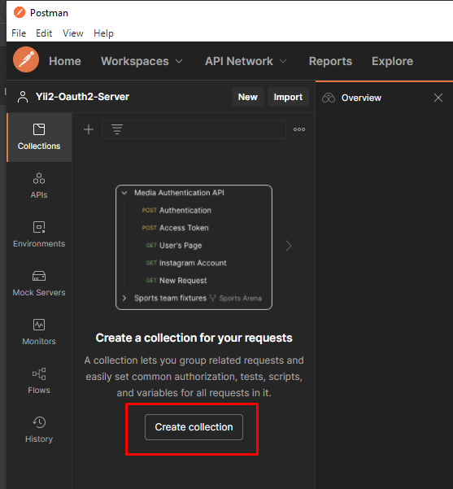

Appendix: Client Configuration
=============================

This chapter describes how to set up different clients.

## Configuring Postman
1. Create a new Collection  
   
2. Set the authorization method of the new Collection to Oauth 2.0  
   
3. Configure Oauth 2.0

| Setting       | Value                                     | Note                                            |
| ------------- | ----------------------------------------- | ----------------------------------------------- |
| Token Name    | My-First-Test-Token                       | Can be anything you like                        |
| Grant Type    | Authorization Code (With PKCE)            | Must match a grant type enabled for the client. | 
| Callback URL  | Check `Authorize using browser`           |                                                 |
| Auth URL      | http://localhost/oauth2/authorize         | The host can vary depending on your local env.  |
| Access Token  | URL: http://localhost/oauth2/access-token | The host can vary depending on your local env.  |
| Client ID     | postman-sample-client                     | The client identifier                           |
| Client Secret | your-client-secret                        | The secret you used when creating the client.   |

4. Click "Get New Access Token".
5. The Oauth 2.0 client authentication flow will start.
    * In case you're not logged in you will be prompted to log in to your app as usual.
    * Authorize the Postman Sample Client by clicking "Allow".
    * The client is now authorized, and you will be redirected back to Postman.
6. Click "Use Token" in Postman.
7. Click "Save Collection".
8. Create a new Request inside your Collection  
   
9. Configure the new Request
    * Set the request url.
      If you created the example API controller as described above you can use `http://localhost/api/user/me`.
    * Make sure the "Authorization" is set to "Inherit auth from parent".
10. Send the Request by clicking "Send".  
    The request will contain an Authorization header containing `"Bearer eyJ0eXAiO..."`.
